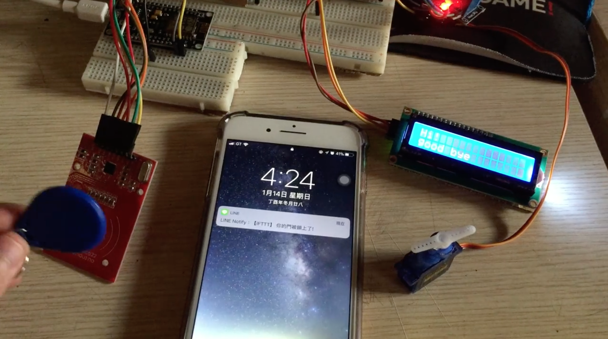

# IoT-Access control system

This is an access control system based on the IFTTT platform and arduino. The program was created when I was in high school. The system is to read the RFID card ID set as a whitelist and RFID card reader can pass the Card  if ID in whitelist and  it will be sent log to Line bot via IFTTT.

* videos: [FacebookLink](https://www.facebook.com/groups/arduinotaipei/permalink/1842761789084597/),[FacebookLink2](https://www.facebook.com/groups/arduinotaipei/permalink/1899362523424523/)
